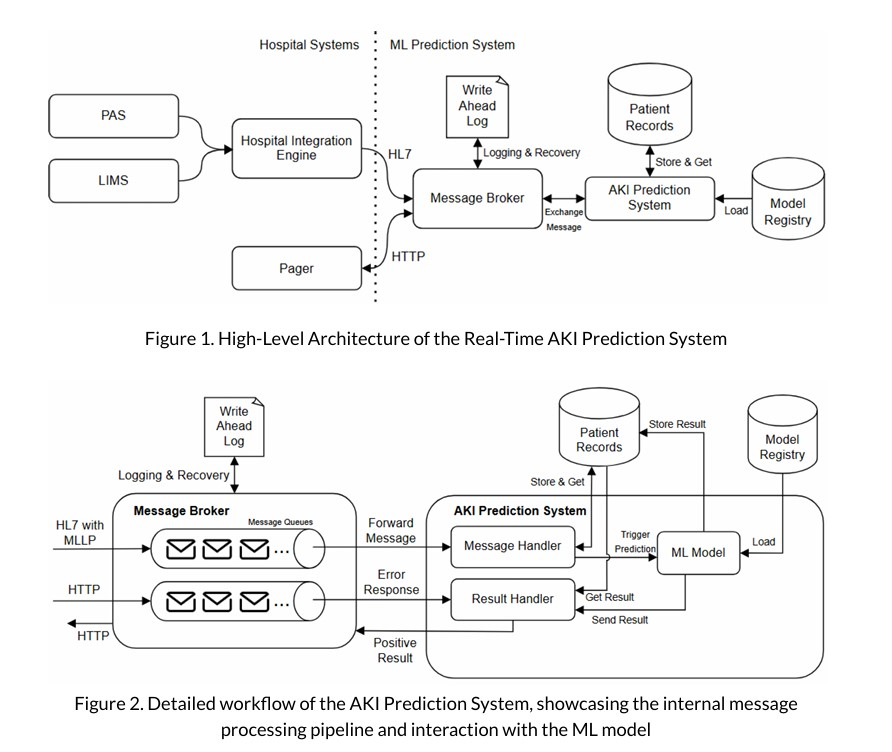

# Real-Time Acute Kidney Injury Prediction System

Our system is designed for processing HL7 messages, managing patient data in a database, and identifying potential Acute Kidney Injury cases based on patients' blood test results.

## High-Level Design of the System


## Project Structure
```
📦 swemls
├── 📂 checkpoints      # Saved models and weights
├── 📂 config           # Configuration files
├── 📂 data             # Datasets
├── 📂 notebooks        # Jupyter notebooks for exploration
├── 📂 simulator        # Synthetic patient data generator
├── 📂 src              # Main ML pipeline components
│   ├── communication   # Handles HL7 message parsing and MLLP ACK generation
│   ├── database        # Manages patient and record storage (in-memory & persistent)
│   ├── ml              # Machine learning models for AKI prediction
│   ├── models          # Data models for patients and medical records
│   ├── service         # Business logic for patients, records, and predictions
│   ├── utils.py        # Utility functions
├── 📂 tests/unit       # Unit tests for core functions
├── .gitignore          # Ignore unnecessary files
├── .gitlab-ci.yml      # CI/CD automation (runs tests automatically)
├── Dockerfile          # Docker container setup
├── main.py             # Entry point for ML pipeline
├── requirements.txt    # Dependencies
```

## **main.py** details
This script facilitates communication between an **Integration Engine**, a **Pager System**, and a **Prediction System** by processing HL7 messages over MLLP.

### Key Details

- **Simplified Design:** No message queue or persistence is used, as all components run in a single Docker container.
- **Patient Handling:** New patients are created upon receiving an **ADT A01 (Admission) message** if they don’t already exist.
- **AKI Prediction:** When an **ORU R01 (Observation Report) message** with a **Creatinine blood test** is received:
  - The result is stored.
  - The **AKI prediction model** is triggered.
  - If AKI is detected, an alert is sent to the Pager System.

### Fault Tolerance

- **MLLP Connection Handling:** The script retries connecting to the MLLP server until successful.
- **Pager System Communication:**
  - Alerts are sent via HTTP.
  - Temporary HTTP failures (500 errors) trigger automatic retries.
  - Permanent failures (400 errors) are logged and skipped.

### Database Handling

- **Preloads patient history from** `data/history.csv`.
- **Uses helper functions** (`src.service.*`) for patient and record management.

## Future Work
- Running Inference on Kubernetes: Example - ⁠Separate Patient Records Database for scalability and performance.
- Adding Monitoring: Write-Ahead Log (WAL) for crash recovery and reliablitly
- Running in a Live Environment: Optimize the system for production use, ensuring fault tolerance and regulatory compliance.
